# Klipper on FlashForge Creator Pro 2

This guide documents the process of installing Klipper firmware on a FlashForge Creator Pro 2 3D printer.

Based on the guide at <https://wiki.evilazrael.de/en/flashforge-creator-pro-2>, this version includes additional details and clarifications for first-time Klipper users.
It is something between Evil's "Basic" and "Advanced" configurations.

## Prerequisites

### ST-LinkV2 Programmer

A ST-LinkV2 programmer is required to flash the firmware. This device can program (and debug) STM32 microcontrollers:

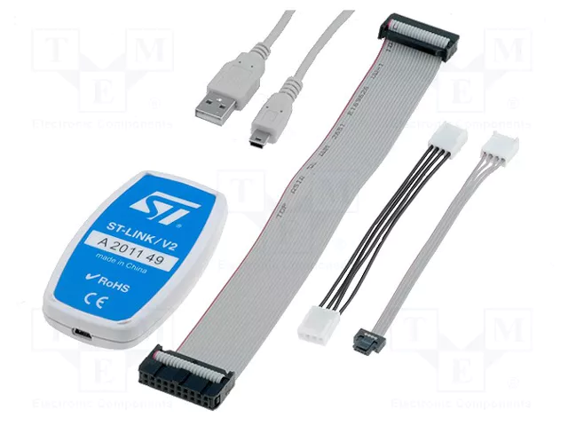

> These cheap clones are available on AliExpress for approximately 5€. Example: <https://www.aliexpress.com/item/1005007096805623.html>

### STM32CubeProgrammer software

In order to flash the firmware onto the printer's mainboard, you'll need to install STM32CubeProgrammer on your computer.
You can download it from STMicroelectronics' website: <https://www.st.com/en/development-tools/stm32cubeprog.html>

### Host Device for Klipper

Klipper is composed of two parts: the firmware running on the printer's mainboard, and a host software that runs on a separate device and communicates with the printer.

For this host device, you can use a Raspberry Pi or any other computer that can run Python. I am using a Raspberry Pi 4.

## Preparing the Raspberry Pi and Building the Firmware

### Step 1: Install Klipper on the Raspberry Pi

The most common approach for installing Klipper is to use a pre-configured OS image that includes Klipper and useful tools (like web GUIs). Popular options are Fluidd and MainsailOS. I used MainsailOS, mostly because Evil also used it in his guide.

You can download MainsailOS directly onto a Raspberry Pi SD card using Raspberry Pi Imager.
See <https://docs-os.mainsail.xyz/getting-started/raspberry-pi-os-based> for more details.

### Step 2: Switch to Evil Azrael's Klipper Fork

> **Important:** The official Klipper version doesn't yet support the FlashForge Creator Pro 2. We need to use Evil Azrael's fork until the PR is merged. Link to PR: <https://github.com/Klipper3d/klipper/pull/6553>

**SSH into the Raspberry Pi:**

Find your Raspberry Pi's address:

- Check your router's admin interface for the IP address, or
- Use the hostname (default: `mainsail`, but can be changed in Raspberry Pi Imager. Mine is `pi-3dprinter`)

Example SSH command:

```bash
ssh pi@pi-3dprinter  # Replace with your hostname or IP. Note that you can change the username in the Raspberry Pi Imager
```

**Switch to Evil's Fork:**

The MainsailOS installation includes the official Klipper repository at `~/klipper`. Update the remote URL and fetch Evil's fork:

```bash
cd ~/klipper
git remote set-url origin https://github.com/eazrael/klipper.git
git fetch
```

**Checkout the FFCP2 Branch:**

Two branches are available: `ffcp2_basic` and `ffcp2`. Use `ffcp2` as it's more up-to-date:

```bash
git checkout ffcp2
```

### Step 3: Build the Firmware

**Configure the Build:**

From the `~/klipper` directory, launch the configuration menu:

```bash
make menuconfig
```

> **Troubleshooting:** If you encounter locale errors, run:
>
> ```bash
> sudo dpkg-reconfigure locales
> ```
>
> Select `en_US.UTF-8` and try again.
>
> Reference: <https://stackoverflow.com/questions/14547631/python-locale-error-unsupported-locale-setting>

**Required Configuration Settings:**

| Setting                       | Value                    |
| ----------------------------- | ------------------------ |
| Micro-Controller Architecture | STMicroelectronics STM32 |
| Processor model               | STM32F407                |
| Bootloader offset             | No bootloader            |
| Communication interface       | USB (on PA11/PA12)       |

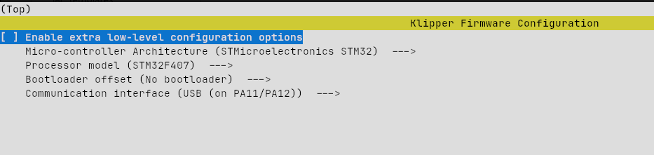

**Save the Configuration:**

- Press `Q` to exit
- Press `Y` to save

**Build the Firmware:**

```bash
make
```

The build process takes a few seconds and outputs the firmware to `~/klipper/out/klipper.bin`.

Once done, copy `klipper.bin` to the computer where you'll run STM32CubeProgrammer.

Example command (adjust paths as needed):

```bash
sftp pi@pi-3dprinter:~/klipper/out/klipper.bin .
```

## Disassembling the Printer and Flashing the Firmware

### Accessing the Mainboard

The mainboard is located at the bottom of the printer. We need to remove several panels to access it.

**Disassembly Steps:**

1. **Tip the printer** to the side opposite the SD card slot (SD slot should face the ceiling)
2. **Remove right side panel** (the one with the SD card slot)
3. **Carefully unscrew the front panel** (with the display)
   - ⚠️ Don't fully remove it - cables are still attached
   - Keep it loosely attached, we only need enough space to slide out the bottom panel
4. **Remove the bottom panel** to access the mainboard


**Disconnect the Screen:**

1. Locate the screen ribbon cable (see image below)
2. Lift the small latch to release the cable
3. Remove the cable

> **Note:** Klipper doesn't support using the screen, so it must remain disconnected.


### Connecting the ST-LinkV2

**SWD Header Pinout:**

The mainboard has a 4-pin SWD (Serial Wire Debug) header:

| Pin   | Function                      |
| ----- | ----------------------------- |
| VCC   | 3.3V power                    |
| GND   | Ground                        |
| SWDIO | Serial wire data input/output |
| SWCLK | Serial wire clock             |

**Wiring Diagram:**

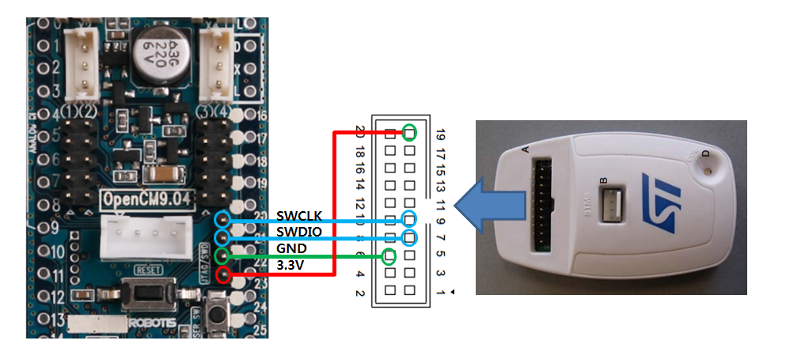

> **Note:** This is an image I found on the Internet. The board on the right is completely wrong, but the ST-LinkV2 pin labels are correct.

### Programming the Firmware

**Launch STM32CubeProgrammer:**

1. Connect the ST-LinkV2 to your computer via USB
2. Launch the programmer (on Linux):

```bash
sudo ~/STMicroelectronics/STM32Cube/STM32CubeProgrammer/bin/STM32CubeProgrammer
```

> **Linux Note:** Running as `sudo` may be necessary for USB access. For more proper use, consider setting up proper udev rules.

**Connect to the Board:**

1. **Hold the printer reset button** (next to the SD card slot)
2. Click **"Connect"** in STM32CubeProgrammer
3. **Release the reset button**
4. Verify successful connection

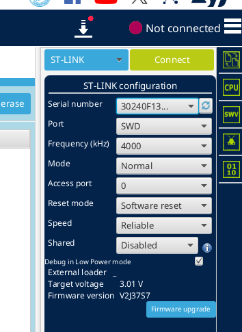

**Flash the Firmware:**

1. Navigate to the **"Erase & Program"** tab
2. Select the `klipper.bin` file
3. Set start address to: `0x08000000`
4. Click **"Start Programming"**

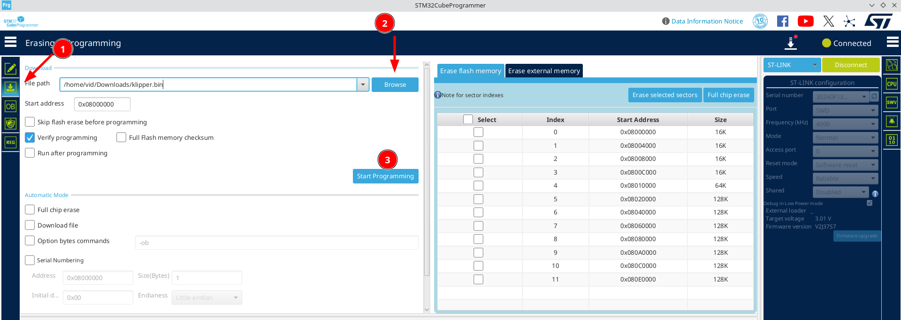

Programming takes a few seconds. Once complete:

1. Disconnect the ST-LinkV2
2. Reassemble the printer (⚠️ **keep the screen cable disconnected**)
3. Connect the Raspberry Pi to the printer via USB A-to-B cable

## Configuring Klipper

### Copy Configuration File

Copy Evil's FFCP2 configuration to your Klipper config directory:

```bash
cp ~/klipper/config/printer-flashforge-creator-pro2.cfg ~/printer_data/config/printer.cfg
```

Then append the macros from `~/klipper/config/printer-flashforge-creator-pro2-macros.cfg` to the end of the same file:

```bash
cat ~/klipper/config/printer-flashforge-creator-pro2-macros.cfg >> ~/printer_data/config/printer.cfg
```

This file includes macros such as `START_PRINT` and `END_PRINT` that will be used later.
One of the macros (`SET_LEFT_ADJUSTMENTS`) might be missing two parantheses. Ensure the code for the macro looks like this:

```gcode
[gcode_macro SET_LEFT_ADJUSTMENTS]
gcode:
    
        SET_GCODE_OFFSET X_ADJUST={(-printer["gcode_macro _FFCP2_CONFIG"].left_nozzle_adjust_x|float)}
        SET_GCODE_OFFSET Y_ADJUST={(-printer["gcode_macro _FFCP2_CONFIG"].left_nozzle_adjust_y|float)}
        SET_GCODE_OFFSET Z_ADJUST={(-printer["gcode_macro _FFCP2_CONFIG"].left_nozzle_adjust_z|float)}
    
        SET_GCODE_OFFSET X_ADJUST={(printer["gcode_macro _FFCP2_CONFIG"].left_nozzle_adjust_x|float)}
        SET_GCODE_OFFSET Y_ADJUST={(printer["gcode_macro _FFCP2_CONFIG"].left_nozzle_adjust_y|float)}
        SET_GCODE_OFFSET Z_ADJUST={(printer["gcode_macro _FFCP2_CONFIG"].left_nozzle_adjust_z|float)}
    
```

(In the last two lines of the else part, the opening parantheses were missing in Evil's original file.)

### Identify the Serial Port

With the printer powered on, list connected USB devices:

```bash
ls /dev/serial/by-id/
```

**Example output:**

```text
usb-Klipper_stm32f407xx_370028001150304235313820-if00
```

The full serial path would be:

```text
/dev/serial/by-id/usb-Klipper_stm32f407xx_370028001150304235313820-if00
```

### Update printer.cfg

In `~/printer_data/config/printer.cfg`, add an incljude for `mainsail.cfg` and set the correct serial port:

```ini
[include mainsail.cfg]  # Include Mainsail configuration

[mcu]
serial: /dev/serial/by-id/usb-Klipper_stm32f407xx_370028001150304235313820-if00  # Your serial port

# ... rest of config
```

**Save and Restart Klipper:**

1. Save the file
2. Restart Klipper from the Mainsail web interface (`http://your-hostname.local/`, e.g., `http://pi-3dprinter.local/`, or your Raspberry Pi's IP address)
3. If everything is correct, you should see the printer connected:

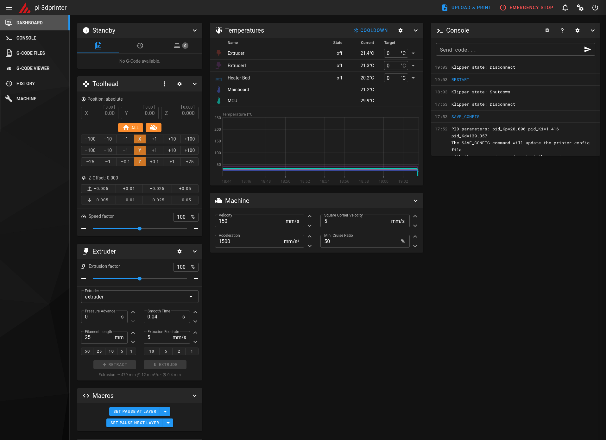

## PID Calibration

PID calibration optimizes temperature control for more stable heating.

### Calibrate the Heated Bed

In the Mainsail web interface, open the console and run:

```gcode
PID_CALIBRATE HEATER=heater_bed TARGET=60
```

**What happens:**

- The bed heats to 60°C multiple times, which takes several minutes
- Klipper measures thermal behavior (you can see waves on the temperature graph, see image)

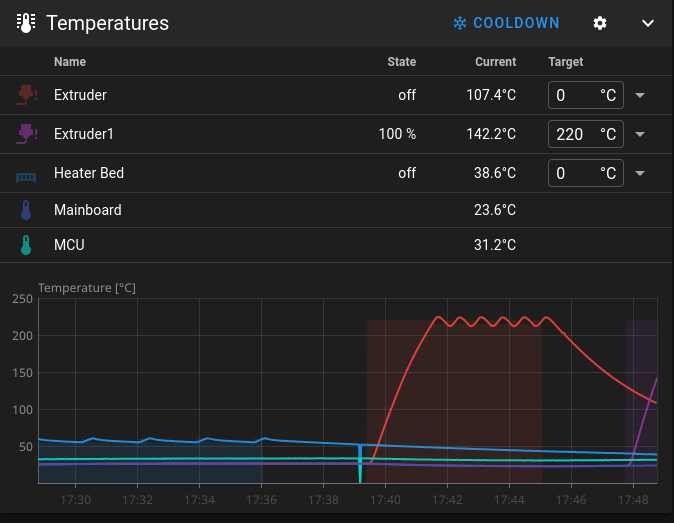

- PID parameters are calculated and displayed in the console
- run `SAVE_CONFIG` to have Klipper automatically save them to the config file

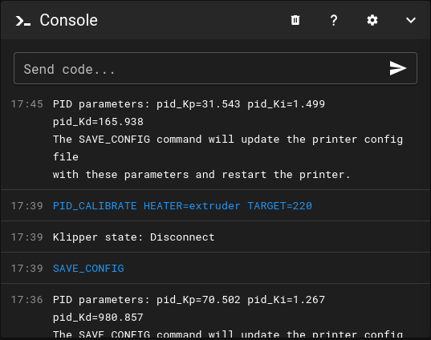

### Calibrate the Extruders

Repeat the process for both extruders:

**Extruder 1:**

```gcode
PID_CALIBRATE HEATER=extruder TARGET=220
SAVE_CONFIG
```

**Extruder 2:**

```gcode
PID_CALIBRATE HEATER=extruder1 TARGET=220
SAVE_CONFIG
```

## Z-axis Calibration

Heat up the bed, I did it to 60°C. You can do it by entering 60 into the Heater Bed temperature field.
Then home all axes by clicking the "Home All" button with the house icon.
This will move the extruders to the edge and all the way to the front and the bed all the way up.


## Slicing Software

For slicing I'll use UltiMaker Cura, mostly because Evil also uses it in his guide.

On Linux you can download the AppImage from <https://ultimaker.com/software/ultimaker-cura/#downloads>, or grab it from GitHub.
If the AppImage won't start (it didn't for me on Debian 13), use the workaround from here: <https://github.com/Ultimaker/Cura/issues/19837#issuecomment-3148695909>

**Adding the printer in Cura:**

1. Add new printer → Non-Ultimaker printer → Custom → Custom FFF printer
2. Give it a name
3. Click Add

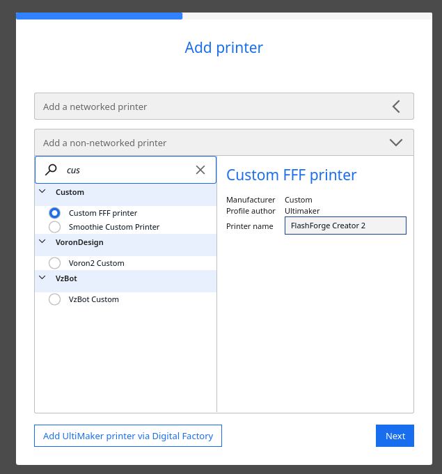

**Printer configuration:**

Change these settings from the defaults:

- **X (Width):** 198 mm
- **Y (Depth):** 150 mm
- **Z (Height):** 150 mm
- **Heated bed:** Yes
- **Number of extruders:** 2
- **Start G-code:**

```gcode
START_PRINT BED_TEMP={material_bed_temperature_layer_0} START_EXTRUDER={initial_extruder_nr}  EXTRUDER_TEMP={material_print_temperature_layer_0} IDEX_MODE={idex_mode}
```

- **End G-code:**

```gcode
END_PRINT
```

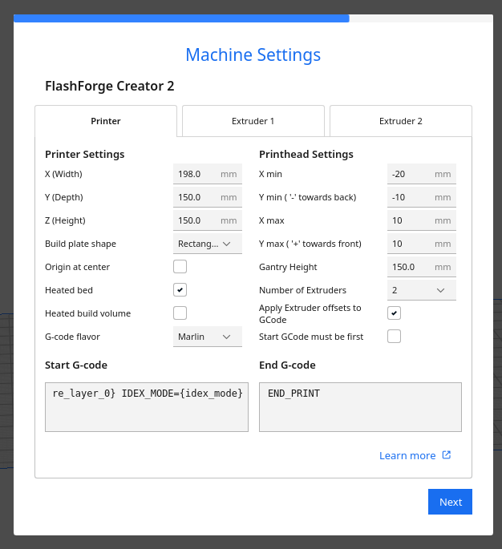

In both extruder tabs, set "Compatible material diameter" to **1.75 mm**.

**Installing the Cura-IDEX plugin:**

1. Download the zip from <https://github.com/Life0fBrian/Cura-IDEX-mode-plugin>
2. Extract it to `~/.local/share/cura/VERSION/plugins` (replace `VERSION` with your Cura version, e.g., `5.11`)
3. Restart Cura
4. Go to Preferences → Configure Cura → Settings and search for "IDEX"
5. Enable both options that appear ("IDEX Mode" and "Adapt bed width")
6. In the Print settings, click "Show Custom"—you should now see "IDEX Mode" under Dual Extrusion

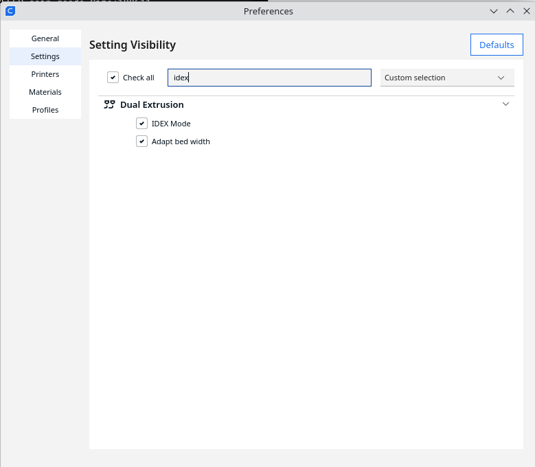

## Usage

**Extruder naming:**

**Klipper:**

- `extruder` = right extruder
- `extruder1` = left extruder

**Cura:**

- `Extruder 1` = right extruder
- `Extruder 2` = left extruder
